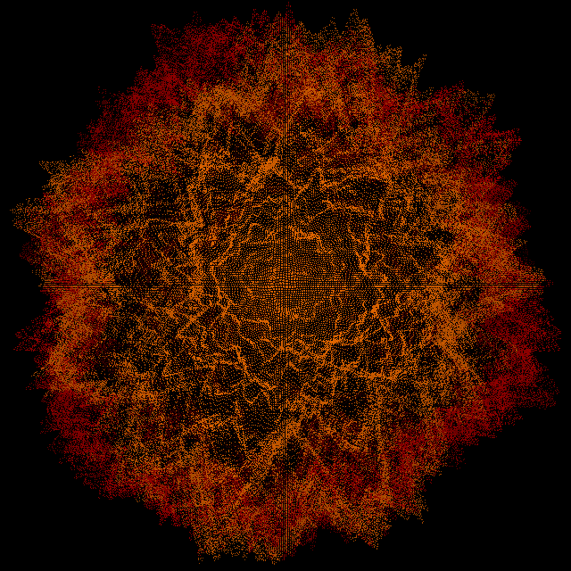
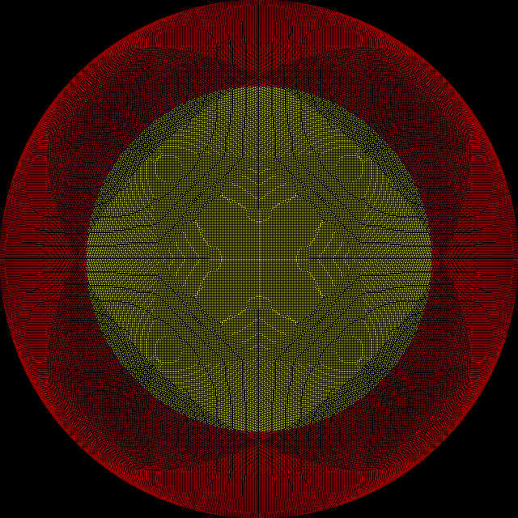

# HTM 

package htm implements a hierarchical triangular mesh suitable for graphic display and querying.

## Installation

`go get dasa.cc/htm`

## Documentation

https://godoc.org/dasa.cc/htm

## Samples

### Noise

### Intersection

